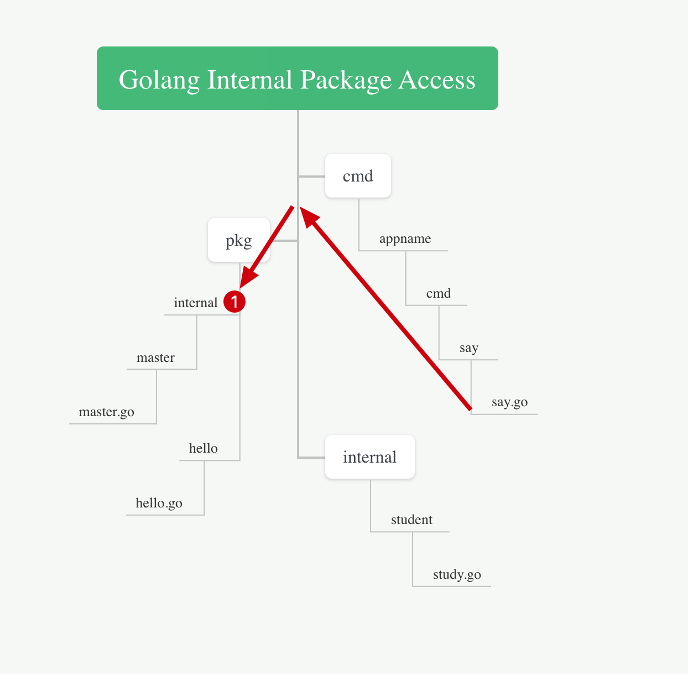

# README.md




```go
// /cmd/appname/cmd/say/say.go 代码
package say

import (
	"github.com/tangx-labs/go-internal-demo/internal/student" // (1)
	// "github.com/tangx-labs/go-internal-demo/pkg/internal/master" // (2)
	"github.com/tangx-labs/go-internal-demo/pkg/hello" // (3)
)

func Say() {
	student.HelloStudent() // (1)

	// master.SayMaster() // (2)

	hello.Hello() // (3)
}
```

在 `/cmd/appname/cmd/say` 访问 `pkg/internal/master` 时， 

1. 找到与 `/pkg` 与 `/cmd` 是相同层级。 
2. 但是 `/pkg/internal` 是子层级， 与 `/cmd/appname` 是同一层级。 
3. 因此属于 **远亲**， 不能直接调用 `/pkg/internal/master`

但是

1. `/pkg/hello` 与 `/pkg/internal` 是同级， 且是 **近亲**， 可以调用。
2. `/pkg/hello` 是公共的
3. `/cmd/appname/cmd/say` 可以通过调用 `/pkg/hello` 间接实现调用 master 的逻辑。（这个也是私有包的公共暴露）

